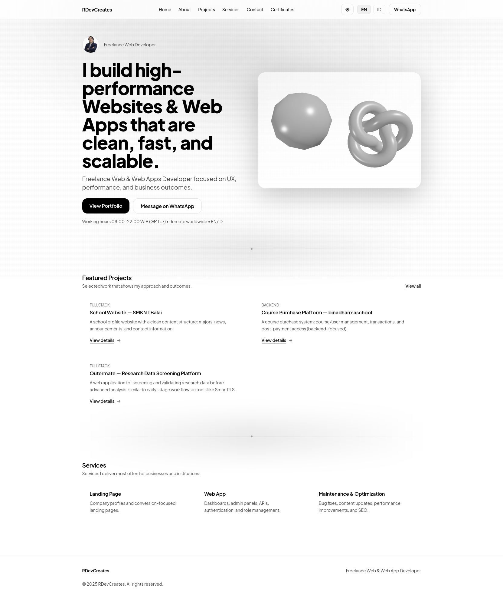
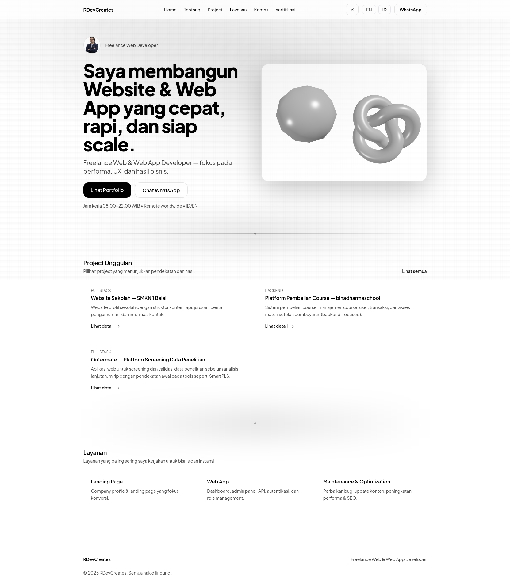
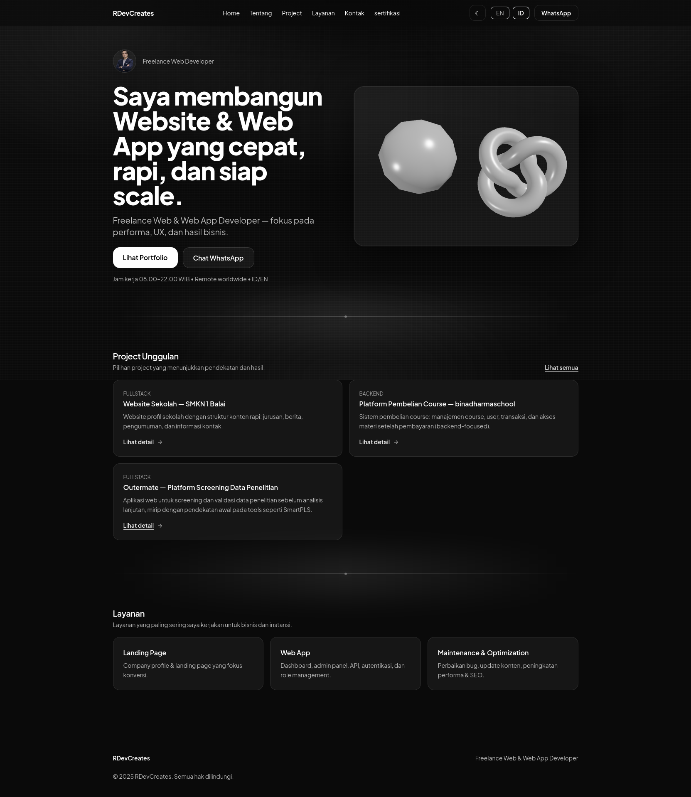

# 🌐 Rdev Portfolio

A personal portfolio and mini-platform showcasing my work, skills, and prototyping experiments around modern web development 🚀

This project goes beyond a static portfolio — it includes tools, reusable UI components, and internal utilities I use to test ideas, iterate, and refine workflows.

🔗 **Live Demo:** https://rdevcreates.my.id

---

## 🎯 Goals

- Show real approach — not just UI demos
- Practice clean architecture & best practices
- Build reusable components and internal tools
- Central hub for work, contact, and experiments

**Target audience**

- ✔ Recruiters
- ✔ Freelance clients
- ✔ Developers

---

## 🔥 Main Features

- ⚡ Vite — super fast dev & build
- 🎨 React + TailwindCSS
- 🌗 Light / Dark mode
- 🌍 Multi-language (EN / ID)
- 🧩 Modular & reusable components
- 🗂 Project + certificates section
- 🧠 SEO utilities
- 📄 PDF export helpers
- 🎭 Lottie animations
- 🏗 Built-in **Wireframe Builder**

---

## 🛠 Tech Stack

### Core

- React (TypeScript)
- Vite
- TailwindCSS

### Architecture & Utilities

- Context API
- Custom hooks
- Zod (schema validation)
- Registry pattern
- i18n JSON localization

### Extras

- Lottie animations
- PDF export tools
- Canvas visual experiments

**Deployment**

- cPanel

---

## 📂 Project Structure (simplified)

```bash
app/               # App shell & routes
components/        # UI + layout + feature components
features/          # Complex modules (builder, projects, etc)
pages/             # Route-level pages
i18n/              # Localization files (EN/ID)
lib/               # SEO, theme, helpers
hooks/             # Custom hooks
styles/            # Global styles
assets/            # Images, icons, lottie


🧰 Wireframe Builder (Highlight)

A built-in tool to quickly prototype landing pages:

configurable sections

theme system

generators

PDF / Hi-Fi export

schema validation (Zod)

Located at:

features/wireframe-builder


Includes:

✔ Editors & renderers

✔ Validation schema

✔ AI prompt helpers

✔ Design tokens & themes

This represents thinking beyond UI — workflow & tooling.






▶️ Development
npm install
npm run dev
npm run build
npm run preview


Node LTS recommended.
```
